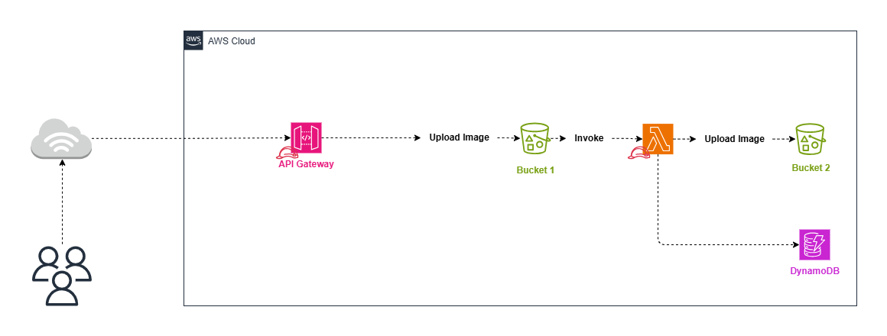

# Serverless Image Processing with S3 and Lambda

This project provisions a **serverless image processing pipeline** using **AWS Lambda, S3, DynamoDB, API Gateway**, and **Terraform**. When an image is uploaded to an S3 bucket, it triggers a Lambda function that:

- Resizes the image to 200x200 pixels
- Stores the resized image in a second S3 bucket
- Logs metadata (original and resized size, timestamp, etc.) to DynamoDB

Additionally, the project provisions an **API Gateway endpoint** to allow external users to upload images to S3 directly via HTTP `PUT` requests.

---

## 🧱 Architecture Overview



---

## 🛠️ Resources Provisioned

| Resource                          | Purpose                                               |
| --------------------------------- | ----------------------------------------------------- |
| `aws_lambda_function`             | Resizes uploaded images                               |
| `aws_lambda_layer_version`        | Provides Pillow dependency to the Lambda function     |
| `aws_s3_bucket` (2 buckets)       | Stores original and resized images                    |
| `aws_dynamodb_table`              | Stores metadata about the images                      |
| `aws_api_gateway_rest_api`        | Exposes an HTTP endpoint for uploading images to S3   |
| `aws_iam_role` + `aws_iam_policy` | Grants Lambda/API Gateway access to required services |
| `aws_cloudwatch_log_group`        | Captures Lambda logs                                  |

---

## 📁 Project Structure

```bash
.
│
└── terraform
│   ├── python
│   │   └── README.md
│   ├── src
│   │   └── index.py
│   ├── main.tf
│   ├── outputs.tf
│   └── variables.tf
└── README.md
```

---

## 🔧 Input Variables (variables.tf)

| Name            | Description                                | Required |
| --------------- | ------------------------------------------ | -------- |
| `env`           | The environment name (e.g., `dev`, `prod`) | ✅      |
| `region`        | AWS region to deploy resources             | ✅      |
| `bucket_1_name` | Name of the S3 bucket for original images  | ✅      |
| `bucket_2_name` | Name of the S3 bucket for resized images   | ✅      |


---

## 📤 Outputs (outputs.tf)

| Output                        | Description                    |
| ----------------------------- | ------------------------------ |
| `function_name`               | Name of the Lambda function    |
| `original_images_bucket_name` | Original image S3 bucket name  |
| `resized_images_bucket_name`  | Resized image S3 bucket name   |
| `logs`                        | CloudWatch Log Group name      |
| `api_gateway_id`              | ID of the deployed API Gateway |

---

## 🚀 How to Deploy

### 1. Clone the repository

```bash
git clone https://github.com/manara-projects/project-2.git
cd project-2/terraform/
```

### 2. Change The destination bucket Name in index.py

```python
destination_bucket = 'ahmed-elhgawy-resized-image' # Replace with your destination bucket
```

### 3. Initialize Terraform

```bash
terraform init
```

### 4. Apply the infrastructure

```bash
terraform apply \
  -var="env=dev" \
  -var="bucket_1_name=your-original-bucket-name" \
  -var="bucket_2_name=your-resized-bucket-name"
```

---

## 📥 How to Use

### 📤 Upload Image via API Gateway

```bash
curl -X PUT \
  -H "Content-Type: image/png" \
  --data-binary "@your-image.png" \
  "https://<api_id>.execute-api.<region>.amazonaws.com/dev/<original-bucket-name>/your-image.png"
```

### 🔁 Lambda Execution

- Triggered automatically on new upload
- Resizes the image
- Uploads to the resized bucket
- Logs to DynamoDB

### 🔎 Check DynamoDB Metadata

```bash
aws dynamodb scan \
  --table-name imageMetadata \
  --region <your-region>
```

---

## 🧪 Lambda Function Behavior

`src/index.py` does the following:

- Gets the uploaded image from S3
- Resizes to 200x200 using Pillow
- Saves the resized image to another S3 bucket
- Records into the `imageMetadata` DynamoDB table:
  - Image name
  - Sizes (original & resized)
  - Buckets & keys
  - Timestamp

---

## 📎 Notes

- Make sure the IAM user/role running Terraform has `s3`, `lambda`, `dynamodb`, `apigateway`, and `iam` permissions.
- You can check Lambda logs in CloudWatch under the log group name outputted.
- You may add CORS headers to API Gateway if using from a frontend.

---

## 🛡️ Security Considerations

- API Gateway is `public` by default — consider adding authorization (API Key, IAM, Cognito).
- S3 buckets should have proper access policies and block public access if not needed.
- IAM roles follow least-privilege principles.

---

## 📬 Contact & Connect

If you’d like to connect, collaborate, or ask questions about this project or AWS DevOps in general, feel free to reach out!

💼 LinkedIn: [Ahmed Elhgawy](https://www.linkedin.com/in/ahmed-elhgawy-a16310268/)

💻 GitHub: [github.com](https://github.com/Ahmed-Elhgawy)

📧 Email: ahmedelhgawy182@gmail.com

I’m always open to networking, feedback, or exciting DevOps opportunities!

---